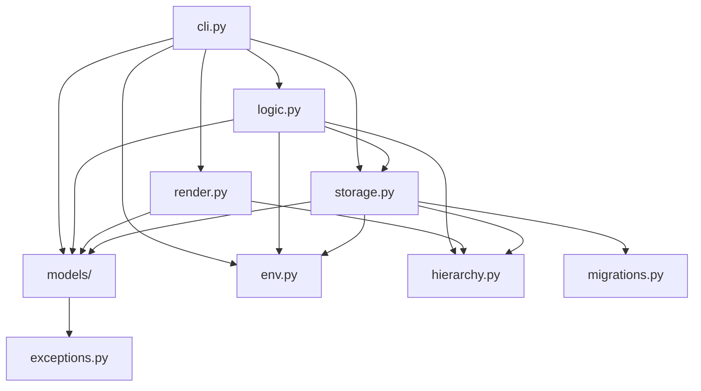

# Architecture

`taskli` is a layered CLI. `cli.py` owns argument parsing and dispatch: it
composes the `argparse` parser, resolves and validates the invoked command,
calls the matching `logic.py` function, and hands the result to `render.py`.
`logic.py` owns per-command orchestration — load via `storage`, mutate via
model methods, save, and return a `CommandResult` (or plain data); it imports
no `render` and prints nothing. `storage.py` owns list- and config-file
content persistence — reading, validating, and writing the config file and
the per-list files; the storage-directory path and a dependency-free
list-name scan live in the `env.py` leaf, which `storage.py` delegates to.
`render.py` owns every piece of console output, building all
`rich` tables, trees, and messages. `models/` holds the pydantic data types
(`TaskliItem` — now a recursive tree via a `children: list[TaskliItem]`
field — `TaskliList`, `Config`), the attribute enums (`Priority`,
`Status`, `Color`, `Operator`), the `SortBy` alias (now a plain `str`
validated against the registry, not an enum), the query value objects
(`Filter`, `Criterion`, `Sort`), the due-date value parser (`dates.py` —
`parse_due_date` / `today` / `midnight`, a leaf beside `attributes.py`
importing only `re`, `datetime`, and `exceptions`), the dotted item-path
sort key (`paths.py` — `path_key`, a leaf that imports nothing), and the
attribute
registry (`registry.py`'s `Attribute` / `ATTRIBUTES` table of
per-attribute domain + render + modifier metadata — filter operators,
sort keys, render column facets (now only on `priority` / `tags` /
`due_date`), plus the `parse` callable and the `modifier_ops` op-name
set — that `query.Sort`, `Config.default_sort`, `render._items_table`,
and the `logic` / `cli` modifier path iterate via `sortable()` /
`renderable()` / `filterable()` / `modifiable(op)`). `_items_table`
leads with a bespoke non-registry `Task` column (id, state marker, and
tree-branch text in one cell — the same sanctioned pattern as
`render_agenda`), with `renderable()` driving only the trailing
`priority` / `tags` / `due_date` columns.
`registry.py` sits on top of both `attributes.py` and `dates.py`. The
registry carries domain, render, and value-parsing facets; the argparse
vocabulary (flags, `nargs`, `metavar`, `dest`) for the same attributes
lives in `cli.py`'s `MODIFIER_FLAGS`. `models/__init__.py` carries no
re-exports — consumers import each leaf module directly (`from .models.tasks
import TaskliList`), though the `registry` module is still imported as
`from .models import registry`. `hierarchy.py` holds the pure list-name hierarchy
helpers (`ancestor_chain`, `parent_list_name`, `child_list_names`,
`descendant_list_names`) — dotted-name string math, no I/O. `exceptions.py` is
the shared `TaskliError` hierarchy. `migrations.py` is a third leaf beside
`exceptions.py` and `hierarchy.py` — the versioned-migration module (stdlib
only), operating on the raw parsed file dicts before model validation:
`CURRENT_LIST_VERSION` / `CURRENT_CONFIG_VERSION`, ordered migration chains
(still one list step, `base → v1`, which also stringifies each item id and
adds `children: []` for the recursive-subtasks shape),
and `migrate_list` / `migrate_config` / `*_needs_migration`, with the
historical label strings (`"done"`, `"todo"`, `"high"`, …) hard-coded as a
frozen contract rather than imported from `attributes.py`. `env.py` is a
fourth leaf (`os` + `pathlib` only) — `resolve_storage_dir` and the
`scan_list_names` list-name glob — and the only leaf that touches the
filesystem; `storage.py` and `cli.py`'s tab-completion path both import it.

## Rules

The rules are the actual architecture. Each is a clause `architecture-checker` can
check a plan against.

1. **One-way dependency chain.** `cli.py` → `logic.py` → {`render.py`,
   `storage.py`} → `models/` → `exceptions.py` (`render.py` and `storage.py`
   are siblings — neither imports the other; `logic.py` imports `storage` but
   never `render`), with `hierarchy.py` a second leaf alongside `exceptions.py`
   (a pure-string module any layer may import), `migrations.py` a third, and
   `env.py` a fourth (`os` + `pathlib`, the one leaf that does filesystem I/O).
   A module imports only from lower
   in the chain, never higher. Concretely: `hierarchy.py`, `migrations.py`, and
   `env.py` import nothing from
   the package; `models/` imports only `exceptions` (and other `models/`
   modules); `storage.py` imports only `models`, `hierarchy`, `migrations`,
   `env`, and `exceptions`;
   `render.py` imports only `models` and `hierarchy`; `logic.py` imports
   `models`, `storage`, `hierarchy`, `env`, and `exceptions` — never `render`;
   `cli.py`
   is the only module that imports `logic.py` or `render.py`, and takes both
   (plus `storage.load_config`) as function-local imports so the tab-completion
   path skips pydantic and rich — at module scope it imports only `env`
   (`resolve_storage_dir` / `scan_list_names`), `exceptions`, `__version__`,
   the `registry` module, and the pydantic-free `models` leaves `attributes` /
   `paths` / `query`; nothing in
   `logic.py`, `{render.py, storage.py}`, `models/`,
   `hierarchy.py`, `migrations.py`, `env.py`, or `exceptions.py` imports
   `render.py`;
   nothing imports `cli.py`.
2. **`models/` is pure data + domain logic.** Pydantic models, enums, field
   validators, in-memory item lookup, pure value parsing (`dates.py`'s
   `re`+`datetime` due-date parser) and criteria construction
   (`query.due_to_criteria`) only — no filesystem access, no `rich` or other
   console output, no `argparse`. The enumeration is descriptive, not
   exhaustive: op-name strings (`registry.Attribute.modifier_ops` holds
   `"add"` / `"edit"`) are admitted; `argparse` types and objects are not.
3. **`storage.py` owns all persistence.** Every read or write of the *content*
   of the config file and the list files goes through a `storage.py` function.
   `cli.py` and `render.py` call those functions; they do not open, read, or
   write project files themselves. The storage-directory path and the
   dependency-free list-name scan live in the `env` leaf (`resolve_storage_dir`,
   `scan_list_names`); `storage.py` delegates `config_file_path` /
   `list_all_lists` to it, and `cli.py`'s tab-completion callback calls
   `env.scan_list_names` directly.
4. **`render.py` owns all console output.** All `rich` usage — `Console`, `Table`,
   `Tree`, `Text` — lives in `render.py`. `cli.py` calls `render_*` functions and does not
   construct `rich` objects or print results directly (no bare `print()`);
   user-facing errors and warnings go through `render_error` / `render_warning`,
   status lines through `render_message`, and raw values (a path, a config
   value) through `render_value`. `logic.py` never prints — it returns a
   `CommandResult` (messages, warnings, exit code, optional list view) or plain
   data, and `cli.py`'s `_emit` turns that into `render_*` calls.
5. **`exceptions.py`, `hierarchy.py`, `migrations.py`, and `env.py` are
   leaves.** `exceptions.py` defines the `TaskliError` hierarchy; `hierarchy.py`
   holds the dotted-name helpers; `migrations.py` holds the versioned migration
   chains and their frozen historical literals; `env.py` holds
   `resolve_storage_dir` / `scan_list_names` / `CONFIG_FILE_NAME`. None of the
   four import anything from the `taskli` package. The first three are pure
   computation; `env.py` performs filesystem access (`mkdir`, `glob`) but still
   imports nothing from the package.

## Dependency Diagram

