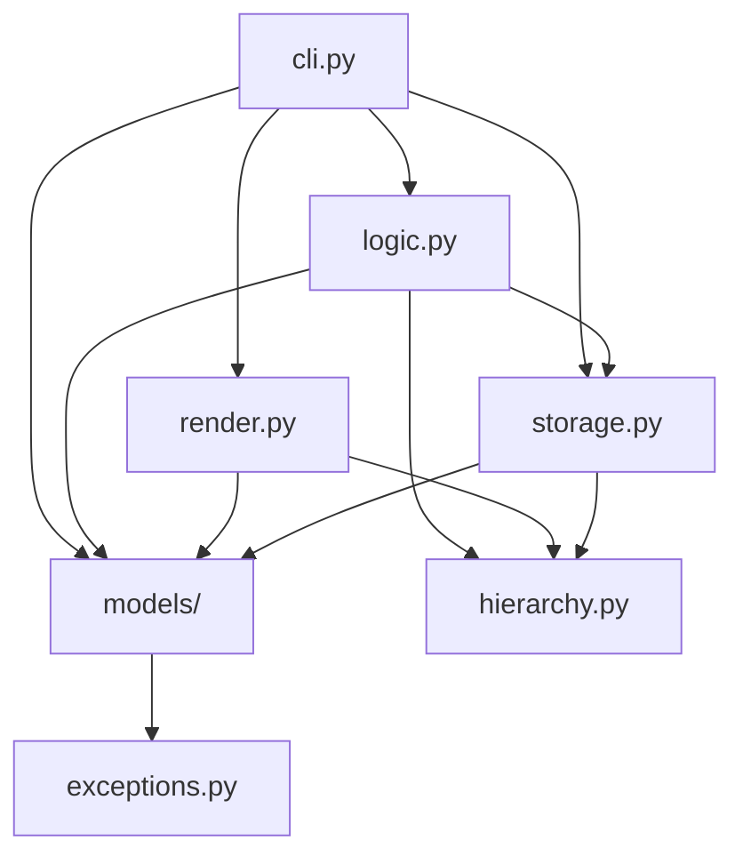

# Architecture

`taskli` is a layered CLI. `cli.py` owns argument parsing and dispatch: it
composes the `argparse` parser, resolves and validates the invoked command,
calls the matching `logic.py` function, and hands the result to `render.py`.
`logic.py` owns per-command orchestration — load via `storage`, mutate via
model methods, save, and return a `CommandResult` (or plain data); it imports
no `render` and prints nothing. `storage.py` owns every filesystem interaction —
resolving the storage directory, reading and writing the config file and the
per-list files. `render.py` owns every piece of console output, building all
`rich` tables, trees, and messages. `models/` holds the pydantic data types
(`TaskliItem`, `TaskliList`, `Config`) and the attribute enums (`Priority`,
`Status`, `Color`, `SortBy`). `hierarchy.py` holds the pure list-name hierarchy
helpers (`ancestor_chain`, `parent_list_name`, `child_list_names`,
`descendant_list_names`) — dotted-name string math, no I/O. `exceptions.py` is
the shared `TaskliError` hierarchy.

## Rules

The rules are the actual architecture. Each is a clause `architecture-checker` can
check a plan against.

1. **One-way dependency chain.** `cli.py` → `logic.py` → {`render.py`,
   `storage.py`} → `models/` → `exceptions.py` (`render.py` and `storage.py`
   are siblings — neither imports the other; `logic.py` imports `storage` but
   never `render`), with `hierarchy.py` a second leaf alongside `exceptions.py`
   (a pure-string module any layer may import). A module imports only from lower
   in the chain, never higher. Concretely: `hierarchy.py` imports nothing from
   the package; `models/` imports only `exceptions` (and other `models/`
   modules); `storage.py` imports only `models`, `hierarchy`, and `exceptions`;
   `render.py` imports only `models` and `hierarchy`; `logic.py` imports
   `models`, `storage`, `hierarchy`, and `exceptions` — never `render`; `cli.py`
   is the only module that imports `logic.py` or `render.py`, and also keeps a
   two-name bootstrap import of `storage` (`resolve_storage_dir`, `load_config`)
   for `main`; nothing in `logic.py`, `{render.py, storage.py}`, `models/`,
   `hierarchy.py`, or `exceptions.py` imports `render.py`; nothing imports
   `cli.py`.
2. **`models/` is pure data + domain logic.** Pydantic models, enums, field
   validators, and in-memory item lookup only — no filesystem access, no `rich` or
   other console output, no `argparse`.
3. **`storage.py` owns all persistence.** Every read or write of the config file
   and the list files goes through a `storage.py` function. `cli.py` and
   `render.py` call those functions; they do not open, read, or write project
   files themselves.
4. **`render.py` owns all console output.** All `rich` usage — `Console`, `Table`,
   `Tree` — lives in `render.py`. `cli.py` calls `render_*` functions and does not
   construct `rich` objects or print results directly (no bare `print()`);
   user-facing errors and warnings go through `render_error` / `render_warning`,
   status lines through `render_message`, and raw values (a path, a config
   value) through `render_value`. `logic.py` never prints — it returns a
   `CommandResult` (messages, warnings, exit code, optional list view) or plain
   data, and `cli.py`'s `_emit` turns that into `render_*` calls.
5. **`exceptions.py` and `hierarchy.py` are leaves.** `exceptions.py` defines the
   `TaskliError` hierarchy; `hierarchy.py` holds the dotted-name helpers. Neither
   imports anything from the `taskli` package.

## Dependency Diagram

