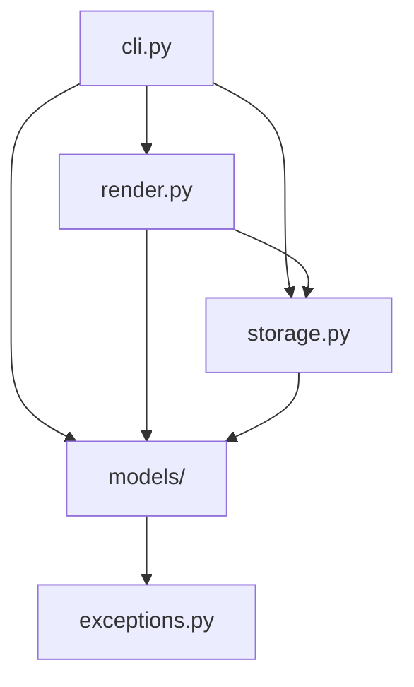

# Architecture

`taskli` is a layered CLI. `cli.py` owns argument parsing and command
orchestration: it composes the `argparse` parser, resolves the invoked command,
and calls into the lower layers. `storage.py` owns every filesystem interaction —
resolving the storage directory, reading and writing the config file and the
per-list files, and the list-name hierarchy helpers. `render.py` owns every piece
of console output, building all `rich` tables, trees, and messages. `models/`
holds the pydantic data types (`TaskliItem`, `TaskliList`, `Config`) and the
attribute enums (`Priority`, `Status`, `Color`, `SortBy`). `exceptions.py` is the
shared `TaskliError` hierarchy.

## Rules

The rules are the actual architecture. Each is a clause `architecture-checker` can
check a plan against.

1. **One-way dependency chain.** `cli.py` → `render.py` → `storage.py` → `models/`
   → `exceptions.py`. A module imports only from lower in the chain, never higher.
   Concretely: `models/` imports only `exceptions` (and other `models/` modules);
   `storage.py` imports only `models` and `exceptions`; nothing below `render.py`
   imports `render.py`; nothing imports `cli.py`.
2. **`models/` is pure data + domain logic.** Pydantic models, enums, field
   validators, and in-memory item lookup only — no filesystem access, no `rich` or
   other console output, no `argparse`.
3. **`storage.py` owns all persistence.** Every read or write of the config file
   and the list files goes through a `storage.py` function. `cli.py` and
   `render.py` call those functions; they do not open, read, or write project
   files themselves.
4. **`render.py` owns all console output.** All `rich` usage — `Console`, `Table`,
   `Tree` — lives in `render.py`. `cli.py` calls `render_*` functions and does not
   construct `rich` objects or print results directly; user-facing errors and
   warnings go through `render_error` / `render_warning`.
5. **`exceptions.py` is a leaf.** It defines the `TaskliError` hierarchy and
   imports nothing from the `taskli` package.

## Dependency Diagram

