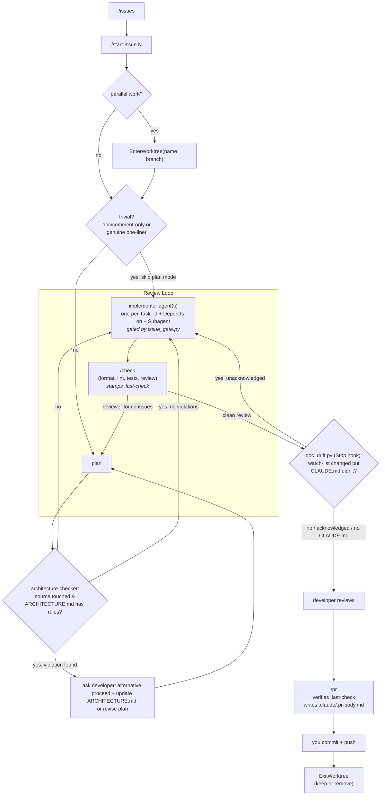

# How this workflow works

Five rules hold in a repo using this workflow. The first three are enforced
mechanically; the last two are enforced by an agent's judgement, with a hook
backstop for rule 4.

## 1. No change without a GitHub issue

Every change traces to an issue.

**Enforcement:** `.claude/hooks/issue_gate.py` runs as a `PreToolUse` hook on
`Edit|Write` and *denies* the edit unless `.claude/.current-issue` records an issue
for the current branch. It also refuses any edit made while on the default branch,
and refuses a record written for a different branch.

Run `/start-issue <number> [more...]` to open the gate. One branch may carry several
issues — record them all.

**Direct prompts, not just `/start-issue`.** A change requested directly, with no
issue on record, gets the same treatment `/new-issue` gives: the `issue-drafter`
agent (`.claude/agents/issue-drafter.md`) is dispatched to draft the issue.
`AskUserQuestion` is unavailable inside subagents, so `issue-drafter` hands its
draft(s) and open questions back; the main agent asks with `AskUserQuestion` and
resumes `issue-drafter` via `SendMessage` with the answers and explicit confirmation
before it creates the issue, then cuts the branch and proceeds — never a silent
auto-create.

Deliberately not gated: paths outside the repo, and `.claude/**` (otherwise this
configuration could never be repaired). Known gap: the gate covers `Edit`/`Write`,
not shell redirection through `Bash`.

## 2. Checks run once per change, at `/check`

**Enforcement:** `/check` is the final step of every plan. It runs in three parts:

- **The formatter** is applied *in place* — formatting has one correct answer, so
  it is fixed rather than reported.
- **Lint and tests** then run (the exact commands are configured in
  `.claude/commands/check.md`). Any failure aborts the change until fixed.
- **The `reviewer` agent** (`.claude/agents/reviewer.md`) then runs a read-only pass
  over the branch's source diff — structure, efficiency, long-term validity,
  isolation of units and behavior — once the checks above have passed. Skipped when
  the diff touches no source. It reports findings; it does not edit.

**Plan mode has a narrow exemption.** A single-file edit that is purely
documentation/comment text, or a genuine one-line fix, may skip formal plan mode —
state the change in a sentence and proceed. Anything touching behavior, spanning
multiple files, or otherwise non-trivial still goes through the full plan-mode flow.

There is deliberately **no `PostToolUse` hook**: nothing is checked while you write.
Checks are a single pass at the end, not once per file.

## 3. Claude never commits or pushes

`git commit` and `git push` are in `permissions.deny` in `.claude/settings.json`,
for both the Bash and PowerShell tools. Staging, branching, diff and log remain
available. `/pr` prepares the title and body and hands the push/create commands back
to you.

---

## 4. CLAUDE.md is checked against reality

*(Only relevant if the repo has a `.claude/CLAUDE.md`.)*

CLAUDE.md makes claims that go stale silently: which hooks are wired, which commands
exist, how checks are enforced. Each claim has a file behind it.

The primary mechanism is the **plan**: `/start-issue` requires every plan to say
whether the change earns a CLAUDE.md update, so documentation is written with the
code rather than bolted on.

**Backstop:** `.claude/hooks/doc_drift.py` runs as a `Stop` hook. It compares the
branch's changed files against a watch list (`.claude/settings.json`,
`.claude/commands/`, `.claude/hooks/`, `.claude/agents/`, `.claude/ARCHITECTURE.md`,
`pyproject.toml`, `.github/workflows/`) and, when any of those changed but
`.claude/CLAUDE.md` did not, blocks the stop with the list. It fires once per
distinct set of changes, recorded in `.claude/.doc-drift-ack` (gitignored). If the
repo has no `.claude/CLAUDE.md`, the hook does nothing.

---

## 5. Architecture is checked before implementation, not after

*(Only active once `.claude/ARCHITECTURE.md` has real rules — see that file.)*

`.claude/ARCHITECTURE.md`'s rules are the architecture contract. A naturally phrased
request breaks them easily, and nothing else catches that before the code exists:
`reviewer` judges structure only inside `/check`, after the code exists;
`issue_gate.py` gates on whether an issue is recorded, not on design.

**Enforcement:** the `architecture-checker` agent
(`.claude/agents/architecture-checker.md`) is dispatched once per plan during
`/start-issue`'s plan step, before `ExitPlanMode`, whenever the plan touches source.
It reads the plan's proposed changes against `ARCHITECTURE.md`'s rules and hands
back any violation, why the rule holds, and a concrete architecture-preserving
alternative. `AskUserQuestion` is unavailable inside subagents, so it hands the
finding back; the main agent asks the developer which way to go — including
proceeding as planned and updating `ARCHITECTURE.md` instead — and folds the answer
into the plan before presenting it.

---

## Lifecycle

Each plan task states an id, a `Depends on: Task N` marker (or `independent`), and
the subagent that executes it — see `/start-issue`'s plan-writing step. Tasks marked
`independent` are dispatched to `.claude/agents/implementer.md` in parallel; a task
with a `Depends on` marker runs only after that dependency lands. This breakdown is
also mirrored into `TaskCreate`/`TaskUpdate` calls before `ExitPlanMode`.

Parallel issues run as separate sessions, each entering its own worktree via
`/start-issue` — not one session juggling several. Worktree cleanup (`ExitWorktree`:
keep or remove) happens after merge, prompted by `/pr`'s handoff or by the harness
at session end — never automatic mid-session.

## Common commands

| Command | What it does |
|---|---|
| `/issues [filter]` | List open GitHub issues to pick from (`gh issue list`, repo via `GH_REPO`) |
| `/new-issue <description>` | File a new GitHub issue — also how Claude handles a direct prompt with no issue on record |
| `/start-issue <n> [n...]` | Fetch the issue(s), cut a `<type>/<kebab-description>` branch, record `.claude/.current-issue`, then enter plan mode |
| `/check` | Formatter, lint, tests, then a `reviewer` pass over the source diff, stamping `.claude/.last-check` |
| `/pr` | Confirm `/check` is current, verify issue + branch, write `.claude/.pr-body.md`, print the push/create commands for you |

## Branch and commit conventions

- Branches: `<type>/<kebab-description>` — `feat/`, `fix/`, `refactor/`, `chore/`,
  `docs/`, `test/`. Match whatever the repo's history already uses.
- Commits / PR titles: `type: Sentence-case description`. Optional scope:
  `fix(build):`.
- Issue linkage lives in the PR body's `Closes #N`, not in the commit message.
